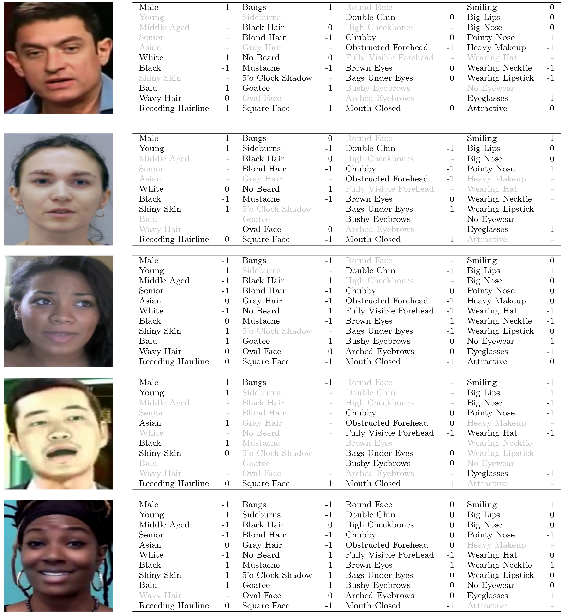

# Massively Annotated DeepFake Databases

We providing 65.3 Mio demographic and non-demographic attribute annotations of 41 different attributes for five popular DeepFake
datasets, Celeb-DF, DeepFakeDetection (DFD), FaceForensics++ (FF++), DeeperForensics-1.0 (DF-1.0), and Deepfake Detection Challenge Dataset (DFDC).

Version 1.1 (22.08.2022)

Version 2.1 (23.03.2023)

* [Research Paper](https://arxiv.org/abs/2208.05845)

## Table of Contents

- [Abstract](#abstract)
- [Database Properties](#database-properties)
- [Annotated Sample Images](#annotated-sample-images)
- [Download](#download)
- [Citing](#citing)
- [Acknowledgment](#acknowledgment)
- [License](#license)


## Abstract

In recent years, image and video manipulations with DeepFake have become a severe concern for security and society. Therefore, many detection models and databases have been proposed to detect DeepFake data reliably. However, there is an increased concern that these models and training databases might be biased and thus, cause DeepFake detectors to fail. In this work, we tackle these issues by (a) providing large-scale demographic and non-demographic attribute annotations of 41 different attributes for five popular DeepFake datasets and (b) comprehensively analysing AI-bias of multiple state-of-the-art DeepFake detection models on these databases. The investigation analyses the influence of a large variety of distinctive attributes (from over 65M labels) on the detection performance, including demographic (age, gender, ethnicity) and non-demographic (hair, skin, accessories, etc.) information. The results indicate that investigated databases lack diversity and, more importantly, show that the utilised DeepFake detection models are strongly biased towards many investigated attributes. Moreover, the results show that the models' decision-making might be based on several questionable (biased) assumptions, such if a person is smiling or wearing a hat. Depending on the application of such DeepFake detection methods, these biases can lead to generalizability, fairness, and security issues. We hope that the findings of this study and the annotation databases will help to evaluate and mitigate bias in future DeepFake detection techniques.


## Database Properties
We provide massive and diverse annotations for five widely-used DeepFake detection datasets, resulting the annotation datasets  **A-Celeb-DF** (9.2M labels), **A-DFD** (4.7M labels), **A-FF++** (8.5M labels), **A-DF-1.0** (38.3M labels), and **A-DFDC** (4.6M labels). 

Existing DeepFake detection datasets contain none or only sparse annotations restricted to demographic attributes. This work provides over 65.3M labels of most 41 different attributes for five popular DeepFake detection datasets ([Celeb-DF](https://www.cs.albany.edu/~lsw/celeb-deepfakeforensics.html), [DeepFakeDetection (DFD)](https://ai.googleblog.com/2019/09/contributing-data-to-deepfake-detection.html), [FaceForensics++ (FF++)](https://github.com/ondyari/FaceForensics), [DeeperForensics-1.0 (DF-1.0)](https://github.com/EndlessSora/DeeperForensics-1.0) and [Deepfake Detection Challenge Dataset (DFDC)](https://ai.facebook.com/datasets/dfdc/)).


## Annotated Sample Images

Below some sample images (forged) are shown including their corresponging attribute annotations. (Top-Down: A-Celeb-DF, A-DFD, A-FF++, A-DF1.0, A-DFDC)

A positive attribute label (the person has this attribute) refers to 1, a negative attribute label (a person does not have this attribute) refers to -1, and a undefined attribute annotation is marked as 0.
<!--  -->


## Download

You can download the annotations for our five datasets from [google drive](https://drive.google.com/drive/folders/1eM0TH8mEjgCz7rZT7OUW6xpHYAy83p5G?usp=sharing).


## Citing


If you use this work, please cite the following papers as well as the respective databases.

```
@article{DBLP:journals/corr/abs-2208-05845,
  author    = {Ying Xu and
               Philipp Terh{\"{o}}rst and
               Kiran B. Raja and
               Marius Pedersen},
  title     = {A Comprehensive Analysis of {AI} Biases in DeepFake Detection With
               Massively Annotated Databases},
  journal   = {CoRR},
  volume    = {abs/2208.05845},
  year      = {2022},
  url       = {https://doi.org/10.48550/arXiv.2208.05845},
  doi       = {10.48550/arXiv.2208.05845},
  eprinttype = {arXiv},
  eprint    = {2208.05845},
  timestamp = {Tue, 16 Aug 2022 16:44:57 +0200},
  biburl    = {https://dblp.org/rec/journals/corr/abs-2208-05845.bib},
  bibsource = {dblp computer science bibliography, https://dblp.org}
}
```

```
@article{DBLP:journals/tifs/TerhorstFKDKK21,
  author    = {Philipp Terh{\"{o}}rst and
               Daniel F{\"{a}}hrmann and
               Jan Niklas Kolf and
               Naser Damer and
               Florian Kirchbuchner and
               Arjan Kuijper},
  title     = {MAAD-Face: {A} Massively Annotated Attribute Dataset for Face Images},
  journal   = {{IEEE} Trans. Inf. Forensics Secur.},
  volume    = {16},
  pages     = {3942--3957},
  year      = {2021},
  url       = {https://doi.org/10.1109/TIFS.2021.3096120},
  doi       = {10.1109/TIFS.2021.3096120},
  timestamp = {Thu, 16 Sep 2021 18:05:24 +0200},
  biburl    = {https://dblp.org/rec/journals/tifs/TerhorstFKDKK21.bib},
  bibsource = {dblp computer science bibliography, https://dblp.org}
}
```

```
@inproceedings{DBLP:conf/btas/TerhorstHKZDKK19,
  author    = {Philipp Terh{\"{o}}rst and
               Marco Huber and
               Jan Niklas Kolf and
               Ines Zelch and
               Naser Damer and
               Florian Kirchbuchner and
               Arjan Kuijper},
  title     = {Reliable Age and Gender Estimation from Face Images: Stating the Confidence
               of Model Predictions},
  booktitle = {10th {IEEE} International Conference on Biometrics Theory, Applications
               and Systems, {BTAS} 2019, Tampa, FL, USA, September 23-26, 2019},
  pages     = {1--8},
  publisher = {{IEEE}},
  year      = {2019},
  url       = {https://doi.org/10.1109/BTAS46853.2019.9185975},
  doi       = {10.1109/BTAS46853.2019.9185975},
  timestamp = {Mon, 14 Sep 2020 18:11:03 +0200},
  biburl    = {https://dblp.org/rec/conf/btas/TerhorstHKZDKK19.bib},
  bibsource = {dblp computer science bibliography, https://dblp.org}
}
```


## Acknowledgment
Parts of this work was carried out during the tenure of an ERCIM ’Alain Bensoussan‘ Fellowship Programme.


## License

This project is licensed under the terms of the Attribution-ShareAlike 4.0 International ([CC BY-SA 4.0](https://creativecommons.org/licenses/by-sa/4.0/)) license.
The copyright of the annotations remains with the Norwegian University of Science and Technology 2022.
